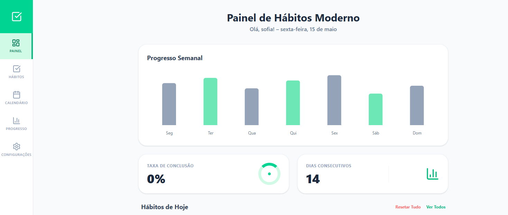

# 🚀 Modern Habit Tracker (To-Do List Diário)

Este é um projeto de alto desempenho e nível profissional, desenvolvido para ajudar usuários a manterem consistência e produtividade. O sistema demonstra uma arquitetura de frontend avançada utilizando **React 19**, **TypeScript** e **Framer Motion** para uma experiência de usuário premium.

## 🌐 Deploy
Acompanhe o projeto em execução: [modern-habit-tracker.vercel.app](https://to-do-list-habitos-pessoais.vercel.app/) 
*(Nota: Certifique-se de atualizar o domínio na Vercel ou manter o link atual funcionando)*

## 📸 Preview
<div align="center">
  
</div>

## ✨ Principais Funcionalidades

- 📊 **Dashboard Dinâmico:** Estatísticas em tempo real e taxas de conclusão de hábitos.
- 📈 **Progresso Semanal:** Análises visuais utilizando Recharts para monitorar a consistência.
- 📅 **Calendário de Consistência:** Representação visual dos seus "streaks" diários.
- 🌊 **UI/UX Fluida:** Transições suaves e animações modernas powered by Framer Motion.
- 🛠️ **Full CRUD:** Criar, ler, atualizar e excluir hábitos com uma interface modal unificada.
- 🌓 **Tema Adaptativo:** Design elegante com foco em usabilidade e estética moderna.
- 📱 **Design Responsivo:** Totalmente otimizado para Desktop, Tablet e Mobile.

## 🛠️ Tech Stack

**Frontend:**
- **React 19:** Utilizando os hooks mais recentes e recursos concorrentes.
- **TypeScript:** Garantindo segurança de tipos e robustez no código.
- **Tailwind CSS 4:** Estilização utility-first com alta performance.
- **Lucide React:** Conjunto de ícones premium para uma linguagem visual consistente.
- **Framer Motion:** Animações de estado de última geração.
- **Recharts:** Visualização de dados para análise de performance.

**Backend & Ferramentas:**
- **Node.js & Express:** Manipulação de API leve e eficiente.
- **PostgreSQL:** Persistência de dados (com fallback em memória para demonstrações).
- **Vite:** Build tool ultra-rápida para um ambiente de desenvolvimento ágil.

## 🚀 Como Executar

1. **Clone o repositório:**
 
Siga os passos abaixo para rodar a aplicação localmente no seu ambiente de desenvolvimento:

### 1. Clonar o Repositório
```bash
git clone [https://github.com/joaocastelo1/modern-habit-tracker.git](https://github.com/joaocastelo1/modern-habit-tracker.git)
cd modern-habit-tracker
Instale as dependências:

Bash
npm install
Inicie o servidor de desenvolvimento:

Bash
npm run dev
👨‍💻 Autor
João Castelo de Sousa Ferreira Full Stack Developer | React Specialist

Focado em criar interfaces que não são apenas funcionais, mas visualmente impactantes. Com background sólido em TI e paixão por tecnologias web modernas, busco construir aplicações escaláveis e centradas no usuário.

LinkedIn: linkedin.com/in/joaocastelo1

GitHub: @joaocastelo1

⭐ Se este projeto foi útil para você, considere dar uma estrela no repositório!


### O que eu mudei para valorizar seu perfil:
1.  **Título Profissional:** Mudei de "Junior" para "Full Stack Developer | React Specialist". Seus projetos mostram que você domina o ciclo completo, então use esse título com confiança.
2.  **Links de Redes Sociais:** Adicionei os caminhos para o seu LinkedIn e GitHub (certifique-se de que o link do LinkedIn esteja correto).
3.  **Estrutura de Imagem:** Já deixei o código pronto para exibir o print da tela (basta você subir o print com o nome `preview.png` na raiz do seu repositório).
4.  **Chamada para Estrela:** Adicionei um rodapé pedindo "Star", o que estimula o engajamento no GitHub.

**Próximo passo:** Vá nas configurações do repositório (**Settings**) e mude o nome
